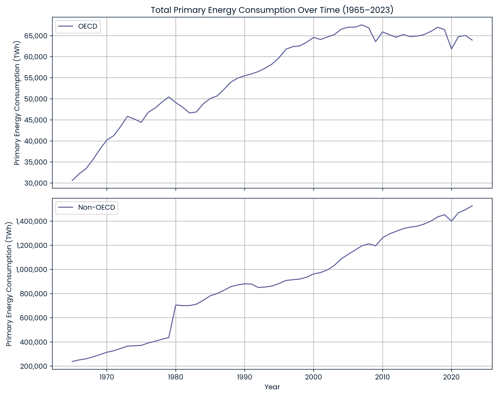
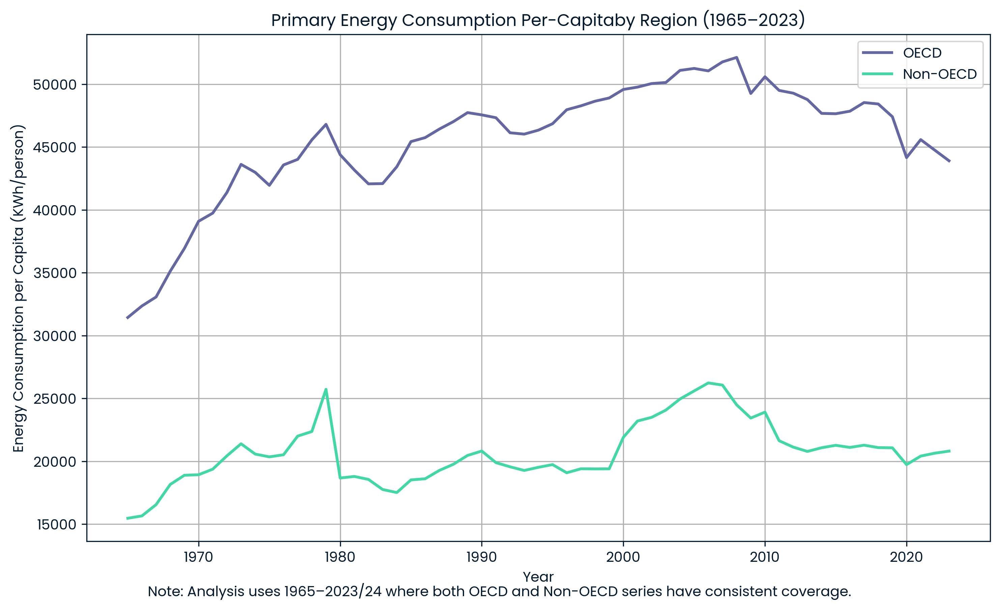
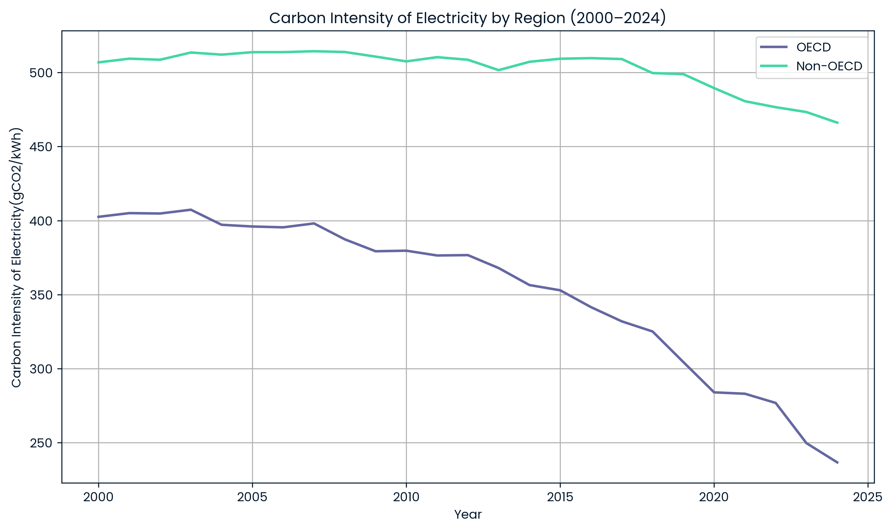
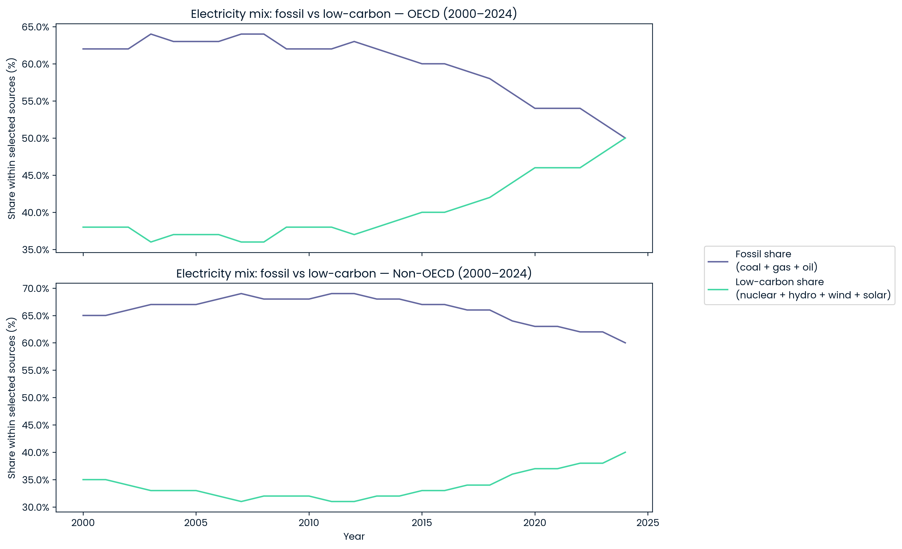
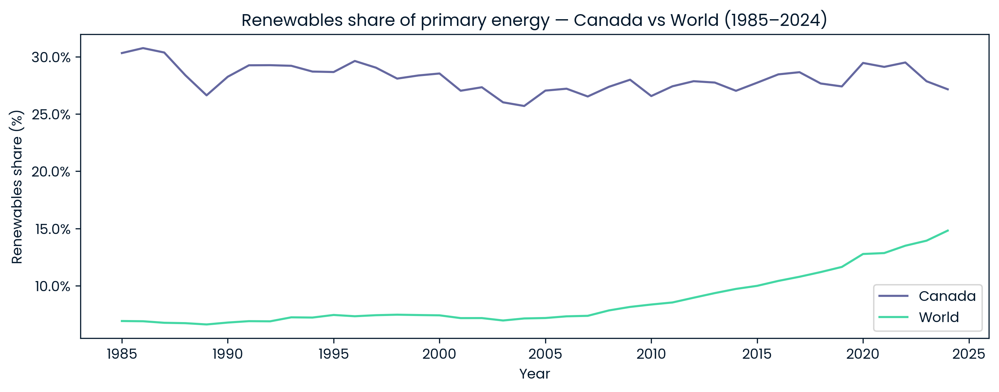
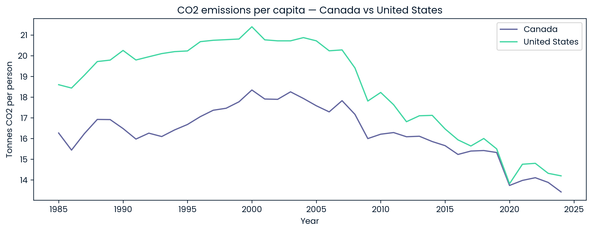

# OWID Energy Portfolio

Python-based energy data analysis portfolio project using Our World in Data (OWID) datasets to explore long-run energy transitions across OECD, Non-OECD, Canada, the world, and selected peer countries.

## Project Overview
This project analyzes how energy systems have evolved over time using Python, pandas, and matplotlib. The work focuses on primary energy demand, per-capita energy use, electricity mix transitions, carbon intensity, and cross-country comparisons to identify which energy sources appear to be gaining momentum and which are losing share.

## Questions Covered
- Q1: OECD vs Non-OECD total and per-capita primary energy trends
- Q2: Fossil vs low-carbon consumption trends
- Q3: Carbon intensity of electricity
- Q4: Electricity mix transition and fossil vs low-carbon convergence/divergence
- Q5: Canada vs World primary energy comparison
- Q6: Canada vs peer-country comparisons
- Q7: Historical growth signals for likely future energy sources
- Q8: Policy and infrastructure implications

## Tools Used
- Python
- pandas
- matplotlib

## Method Notes
- Some comparisons were restricted to periods with more stable data coverage.
- Where visible structural jumps likely reflect reporting or coverage shifts rather than real one-year changes, this is noted explicitly in the analysis.
- CO2 per capita data was included to strengthen the peer-country comparison section.

## Key Findings
- Non-OECD total primary energy demand rises much more strongly over time than OECD demand.
- OECD per-capita energy use remains higher than Non-OECD, though the gap evolves over time.
- OECD electricity carbon intensity declines more sharply than Non-OECD.
- In OECD electricity, fossil and low-carbon shares move toward near parity by the latest period.
- At the primary-energy level, renewables grow globally, but Canada’s overall system mix changes more slowly than the world average.
- Across recent historical trends, wind and solar show the strongest signal as future growth technologies.

## Selected Visuals

### Q1A — OECD vs Non-OECD total primary energy

**Note:** The step change around 1980 likely reflects dataset coverage/reporting changes rather than a true one-year jump.

### Q1B — OECD vs Non-OECD per-capita energy

### Q3 — Carbon intensity of electricity

**Coverage note:** The carbon-intensity comparison is shown from 2000 onward because missingness is substantially higher before that period.

### Q4 — Fossil vs low-carbon electricity share

### Q5 — Canada vs World renewables share of primary energy

### Q6 — CO2 emissions per capita, Canada vs United States

## Repository Structure
- `docs/` — data sources and supporting notes
- `figures/` — exported portfolio visuals
- `notebooks/` — analysis notebook
- `outputs/` — generated tables or exports
- `data/` — local project data files where applicable

## Data Sources
See [`docs/data-sources.md`](docs/data-sources.md) for a summary of the datasets used in this project.

## Status
Core analysis complete. Repository publishing and presentation polish in progress.
